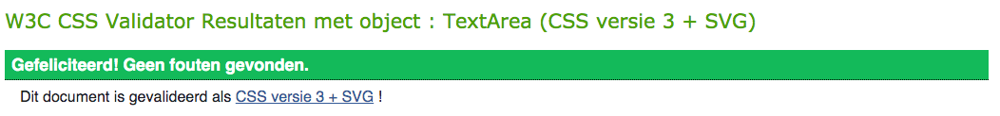
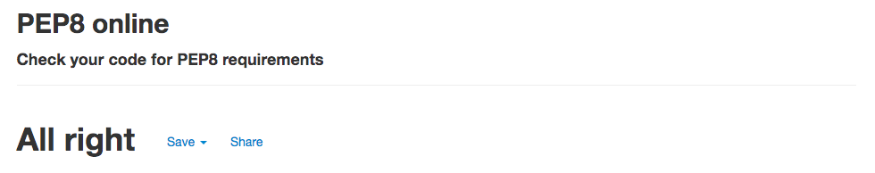
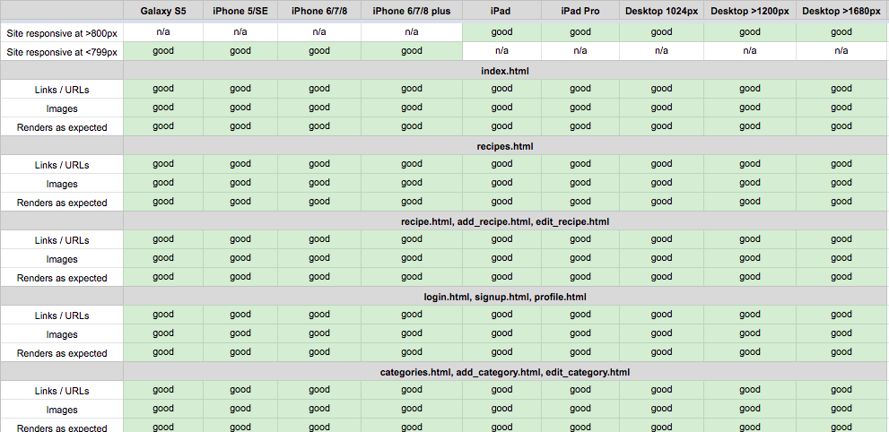
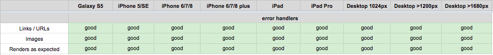
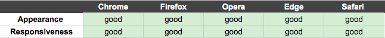

<h1 align="center">Testing</h1>

---

## Index 

- <a href="#validators">1. Code validators</a>
- <a href="#responsiveness">2. Responsiveness</a>
- <a href="#browser-compatibility">3. Browser compability</a>
- <a href="#user-stories">4. Testing user stories </a>
- <a href="#defensive-design">5. Defensive design</a>
- <a href="#bugs">5. Bugs</a>

---

<span id="validators"></span>

## 1. Code validators
 - **[HTML Validator](https://validator.w3.org/):** No errors or warnings to show.

XXXXXX

- **[CSS Validator](https://jigsaw.w3.org/css-validator/):** No errors found.


- **[JS Hint](https://jshint.com/):** No errors found, two warnings, one undefined variable 
    - 2 warnings consist the notification: 'let' is available in ES6 (use 'esversion: 6') or Mozilla JS extensions (use moz).
    - 1 undefined variable: $

- **[Python validator | PEP8](http://pep8online.com/):** No errors found


---

<span id="responsiveness"></span>

## 2. Responsiveness 
- Responsiveness of the game is tested with [Chrome DevTools](https://developers.google.com/web/tools/chrome-devtools) and [Responsive Design Checker](https://www.responsivedesignchecker.com/).
- The game is tested on the following devices: 
    - Desktop: 1024px, 1366px, 1440px, 1600px and 1680px. 
    - Mobile & Tablet: Galaxy S5, iPhone 5/SE, iPhone 6/7/8, iPhone 6/7/8 plus, iPhone x, iPad and  iPad Pro




### Notes
- The Favicon (the logo in next to the title) doesn't work on the profile page, recipes page, recipe pages, edit page and edit category page. I think this has to do with getting data from the db on these pages.

---

<span id="browser-compatibility"></span>

## 3. Browser compatibility


--- 

<span id="user-stories"></span>

## 4. Testing user stories 

### First-time visitor goals:
1. As a first time visitor, I want to be able to visit the website on every device, so that I can look at the website on desktop, mobile and tablet. 
    - The first time visitor can visite the website on a computer, laptop, tablet and phone.
2. As a first time visitor, I want to be able to navigate easily through the website, so I can find everything easily. 
    - The first time visitor can navigate through the website with the navbar. The navbar is on top of the website. For the mobile visitors there is a hamburger menu. If the first time visitor will go to recipes, there is a dropdown with the choice to visit all recipes or to go to a specific category. 
3. As a first time visitor, I want to see an overview of all recipes, so I can get inspired by all recipes.
    - The first time visitor can visit an overview of all recipes by clicking on recipes and then all recipes. On this page there is an overview of all recipes made. 
4. As a first time visitor, I want to be able to search recipes by categories, so I can quickly scan the recipes by category. 
    - In the navbar by recipes, there is a dropdown. If the first time visitor clicks on recipes, the first time visitor has a choice to visit all recipes or visit only recipes with a specific category. 
5. As a first time visitor, I want to be able to search recipes based on words, so I can find recipes easily. (For example, I can search the word banana and all recipes with the ingredient Banana or banana in the recipe name will appear.)
    - On the recipes pages there is a searchbar, where first time visitors can search for words. The search is based on the title of the recipe or the ingredients. 
6. As a first time visitor, I want to register an account on the website, so I can share my recipes on Breaktasty. 
    - The first time visitor can navigate to the signup page by clicking on login/signup CTA in the top navbar. If the first time visitor clicks on the CTA they have a choice to login of signup. If the first time visistor clicks on signup, they will navigate to the signup form on the website. 
7. As a first time visitor, I want to sign up for the newsletter. 
    - The first time visitor can go to the footer to sign up for the newsletter. In the footer there is a input field where the first time visitor can fill in their email to signup.

### Site member goals
1. As a site member, I want to add my recipes, so I can share my recipes.
    - A site member can add recipes to click on 'Add new recipe' in the navbar or to click on the CTA: add new recipe on the profile page. Both ways lead to the add recipe form where site members can add a new recipe. 
2. As a site member, I want to edit my recipes, so I can update information in the recipe.
    - A site member has a profile page. On the profile page, there is an overview of all recipes made by the site member. By each recipe there is a edit button. If the site member clicks on the edit button they will navigate to the edit recipe form, where they can edit there recipe.
3. As a site member, I want to delete my recipes, so I can remove the recipe when it is no longer relevant. 
    - A site member can delete a recipe on the profile page. There is an overview of all recipes mede by the site member on the profile page. There is a button by each recipe, to delete the recipe. 
4. As a site member, I want to login to my profile, so I have access to my recipes. 
    - A site member can login by clicking on login/signup at the top navbar on the website. 
5. As a site member, I want to logout to my profile, so I can logout from my profile. 
    - As a site member is logged in they can logout by clicking on logout at the top navbar.

### Admin goals
1. As an admin, I want to add new categories, so I can make the categories clear and manageable. 
    - The admin can add new categories by going to the category page and to click on add category.
2. As an admin, I want to edit categories, so I can update categories. 
    - The admin can edit categories by going to the category page and to click on edit category.
3. As an admin, I want to delete categories, so I can remove categories when they are no longer relevant. 
    - the admin can delete a categorie by going to the category page and to click on delete category.

---
<span id="defensive-design"></span>

## 5. Defensive design 

1. The user is not able to break the site by clicking on buttons. 

**Answer 1:** All buttons on the website work. The buttons on the website consist buttons that lead to other pages or submit buttons to add, edit or delete something from the database.

2. The signup form: 
    - 2.1 The username has to be between 5-20 characters and only must contain letters and numbers.
    - 2.2 The password has to be between 5-20 characters and must contain at least one number, and one uppercase and lowercase letter.
        
3. The add and edit recipe form:
    - 3.1 The recipe name has to be between 1-20 characters and only must contain letters and numbers
        - The validation for the recipe name is done with front end validation and by using 
    - 3.2 The category has to be chosen.
    - 3.3 The image URL must start with http:// or https://.
    - 3.4 The number of serves and prepping time has to be numbered.
4. By the email subscriber, the email must be in the following order: characters followed by a @ symbol, followed by more characters and then a “.”.

**Answer 2 + 3 + 4:** 
The validation of all input fields is done with front end validation and by using the validate functionality from materialize. 

- The input fields between a number  of characters. This is done by setting a minlength and maxlength. 
- The input fields habe a number of criteria. These criterias where set by the pattern attribute.
- The html type attribute is used to set for example numbers, text, email or url.
- The required functionality is used to make the input fields required. 

See below the input fields for front end validation
    
    ```
    Signup: 
    <input id="username" name="username" type="text" minlength="5" maxlength="20" pattern="^[A-Za-z0-9_]{5,20}$" class="validate" required>
    <input id="password" name="password" type="password" minlength="5" maxlength="20" pattern="^(?=.*\d)(?=.*[a-z])(?=.*[A-Z]).{5,20}$" class="validate" required>

    Add and edit recipe:
    <input id="recipe_name" name="recipe_name" type="text" pattern="^[A-Za-z0-9\s]{1,20}$" class="validate" required>
    <select id="category_name" name="category_name" class="validate" required>
        <option value="" disabled selected>Choose category</option>
            
                <option value="{{ category.category_name}}">{{ category.category_name}}</option>
            
    </select>
    <input id="img_url" name="img_url" type="url" pattern="https?://.+"  class="validate" required>
    <input id="serves" name="serves" type="number" class="validate" required>
    <input id="prep_time" name="prep_time" type="number" class="validate" required>

    Subscribe email:
    <input id="email" name="email" type="email" pattern="[a-z0-9._%+-]+@[a-z0-9.-]+\.[a-z]{2,}$" class="validate">
    ``` 

5. A recipe or category can't be deleted by just one click. If someone clicks on the delete button, there wil be a pop up with a confirmation if someone is sure to delete the recipe or category.

**Answer 5:**: If someone clicks on the delete button, a modal (from materialize) will pop up with the text: Are you sure you want to delete (recipe name/ categoryname). If the user clicks again on delete the recipe or category will be deleted from the database.

--- 

<span id="bugs"></span>

## 6. Bugs | Solved
1. A bug was found by running the project. I just started the project and set everything in place, such as connecting to MongoDB, installed flask and made the env.py and setup for my app.py. I took after that a little break to celebrate christmas and new year, but when I opened the project I couldn't run the project and got an error by running the app.
    - After my break from the project, I accidentally opened a new workspace on gitpod therefore my app wasn't running, because everything I installed with for example Flask wasn't pushed to GitHub. I have solved this by opening my old workspace and by pinning it. The rest of the project I runned in the same workspace, whereby everything worked fine.
2. A bug was found by adding or editing a recipe the instructions input field came as an array in the database, instead of a string.
    - I have solved this problem looking closely in my app.py. In the code by sending the instructions of the recipe to my database I had used the getlist() functionality, whereby the input as an array was saved. I removed the getlist() and the instructions where saved as a stirng. 
3. A bug was found by making a modal the confirm the delete functionality. The modal worked, but deleted the wrong recipe (wrong id). The bug was caused by the modal of materialize. A modal was created for every recipe but every single modal has an identical id and every single delete button targets that one single id of modal.
    - I have solved this problem by using loop indexing. The loop indexing creates a unique id for each model depending on it's index in the loop.

---

[Go to README.md file](README.md).